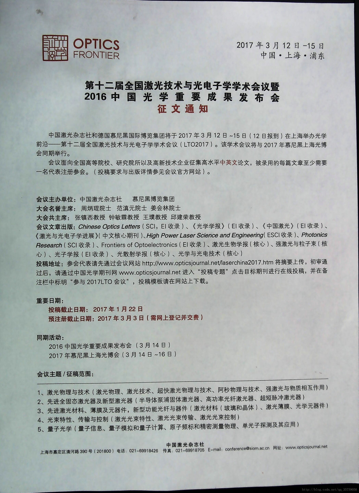
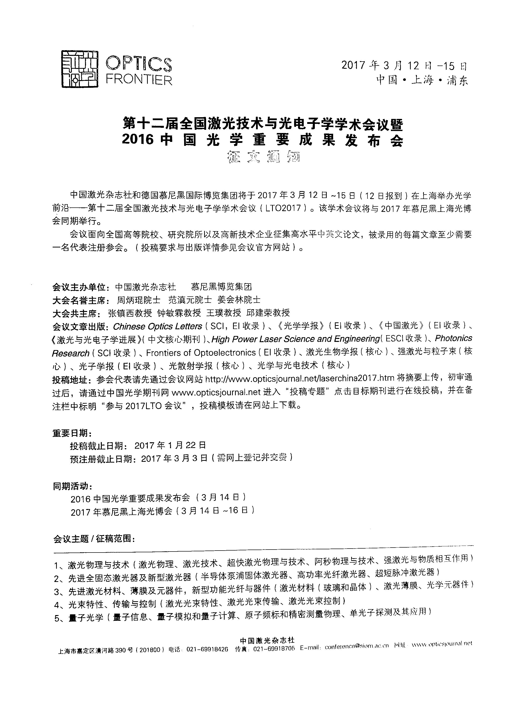

# 基于pyqt、opencv的图像扫描及去黑边程序

## The effect 效果

## main.py 
> run the script file<r>
> 运行该脚本来启动程序

## dist/scan.exe
> Packaged executable file 
> 打包好的可执行文件

## install.py
> Run the script to package the program under the dist folder 
> 运行该脚本来打包程序之dist文件夹下

## scan.py
> The code file that contains the pyqt program body 
> 包含pyqt程序主体的代码文件

## ui_temp/scan.ui
> UI script created by qt designer 
> qt designer创建的UI脚本

## img_test/
> A folder for placing test images 
> 用于放置测试图片的文件夹